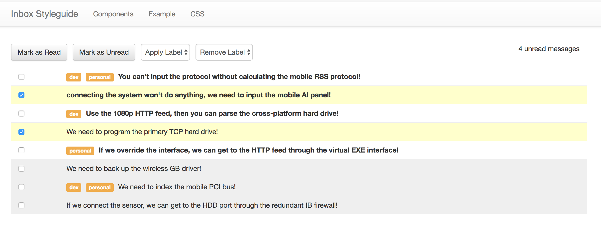

# Inbox Styleguide

This project contains all of the HTML and CSS you need to build the frontend Inbox project.  There are 3 main parts:

## Components

This shows you all of the individual components with both a preview and the HTML source:


## Example

This shows you an example of what the app should look like:



## CSS

This gives you the CSS you can copy to your project:


## Installation

Clone this repo, then:

```
cd inbox-styleguide
yarn
yarn start
```

Then open http://localhost:6565
